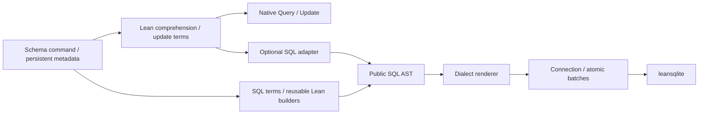

# 设计记录

## 三个边界

前端的 `Query α` 保存参考语义，不保存一套自定义的封闭标量语言。Comprehension elaborator 引入真正的 Lean binder，把各 clause 展开为可扩展的 term。更新请求同样保存普通 Lean 函数。

`query% [...]`／`query% { ... }` 构造原生请求，`sql% [...]`／`sql% { ... }` 构造 SQL 查询。它们共用 `querySpec` parser 与 `expandQuerySpec`，只有最终 consumer 不同；`query` 不作为关键字注册。`sql%` 也接受已有查询定义或组合子 term。

`sql%` 在 elaboration 阶段读取已 elaborated 的 Lean Expr，识别组合子和标量运算、展开定义、调用登记的 SQL 函数规则。这是一个独立 consumer。它生成 SQL AST 的 Lean 构造程序，允许外部参数在运行时求值。运行时的数据库行值不提前在 Lean 中计算。

`@[sql_function "NAME" n]` 与 `attribute [sql_function "NAME" n] fn` 共用 Lean 的 attribute 机制。参数语法参考 [binary 的 `bin_enum`](https://github.com/Lean-zh/binary/blob/master/Binary/Deriving.lean)，注册和作用域采用 [`ext` 的写法](https://github.com/leanprover/lean4/blob/v4.34.0/src/Lean/Elab/Tactic/Ext.lean)：`registerBuiltinAttribute` 配合 `SimpleScopedEnvExtension`，把 Lean 传入的 `AttributeKind` 直接交给扩展的 `add`。规则归属于应用 attribute 的模块，可以标记 `String.toLower` 等导入声明；不按函数的定义模块查找。

[Lean 的 scoped extension](https://github.com/leanprover/lean4/blob/v4.34.0/src/Lean/ScopedEnvExtension.lean)负责导入和作用域栈：global 规则立即启用，scoped 规则随 namespace 导出、打开时激活，local 规则只修改当前作用域且不导出。活动规则按函数名存入 `NameMap`，后登记或激活的规则覆盖此前规则，离开作用域后恢复。没有新增 `local`／`scoped` parser，也不自行模拟 `open`。

标准规则模块 `LeanRel.Compiler.SQL.Standard` 由 `LeanRel` 自动导入，所有规则位于 `LeanRel.SQL.Standard` namespace 并标记 scoped；用户显式打开它才能启用。它覆盖大小写、拼接、字符长度、绝对值、符号和可空值回退。字符长度用中端 `CHAR_LENGTH` 表示，SQLite renderer 负责改成 `LENGTH`，避免把 MySQL 的字节长度当字符长度。

中端有自己的公开 SQL AST，以及直接构造它的 Lean builder。`SQL.Plan`／`SQL.Scalar` 使用统一的别名供应来组合相关子查询；schema 生成的 `Columns F` 提供类型明确的字段访问。这里的 SQL 语义是中端自身的，不要求用户经过前端。

SQL renderer 负责方言差异；connection 负责准备语句、绑定值、结果读取、事务和冲突检查。任何新数据库都实现这一接口，不修改前端。

## 为什么选择 schema command

[Lean-zh/protobuf](https://github.com/Lean-zh/protobuf) 的 internal notation 展示了很适合这里的方法：把声明展开成常规 Lean 定义，并用环境扩展保留额外信息。这里采用同一路线，生成原生记录、通用字段容器、codec 和普通 schema 值，同时登记可导入的元数据。

只返回一个运行时 schema 值不足以直接产生可用的原生字段声明；command 可以同时提供两者。`.schema`／`.table` 仍可以作为普通值传参。SQL adapter 根据静态 row type 获取字段，物理 source 的名字可以来自运行时值。

字段容器 `Person.Columns F` 的参数不特指 SQL。它可以容纳当前的 `SQL.Scalar`，也可以用于后续解释器。消费者无须再维护一套字符串列名映射。

## DSH 提供的参考

[Database-Supported Haskell](https://db.cs.uni-tuebingen.de/research/past-projects/database-supported-haskell/) 展示了宿主语言 comprehension、嵌套查询与数据库执行的结合。这里保留宿主语言组合能力，但没有照搬 Haskell 的语法边界，也没有把 SQL 构造器设成前端唯一的表达能力。

当前嵌套实现把 child query 收集成 positional JSON rows，并由输出 Shape 还原记录、元组和列表。排序键进入聚合排序，空集合返回空列表。它便于端到端验证，尚不是 DSH 的完整 query shredding 和优化器实现。

## Relational lenses 提供的约束

[Incremental Relational Lenses](https://arxiv.org/abs/1807.01948) 中的 select／merge、函数依赖和 join 删除策略决定了更新不能简单反向翻译 SELECT。此实现先保留显式 source key、FD、丢失信息的恢复策略和删除策略，再做 snapshot propagation。

[Language-Integrated Updatable Views](https://arxiv.org/abs/2003.02191) 也强调可更新视图的限制与语言层检查。这里允许任意 Lean selection predicate，因此没有宣称能静态决定所有 predicate 的可更新性：目前使用 checked partial operations，失败返回错误，成功路径检查 PutGet。

当前保留键的 projection 比通用 drop lens 更受限；join 要求共享字段决定右侧，来源不重叠。增量 delta propagation、依赖图限制的静态证据、具体操作的总性／lens law 证明应是后续独立工作，不能从抽象 lens composition theorem 推得。

## 参考 lean-linq 的范围

[lean-linq](https://github.com/palladin/lean-linq) 的参考价值在于使用体验：原生函数可复用、字段携带类型、查询可以组合。这里没有采用它的 PHOAS／分组 GADT 体系。直接字段访问来自 schema 元编程；SQL syntax 的内部 elaborator 会先确定 source 的字段容器，再 elaboration 回调，从而避免类型类求解顺序阻碍 `p.age` 的字段解析。

中端的 typed builder 检查字段与标量操作类型；它没有证明全部 SQL grouping／scope 规则。公开 AST 和完整语句入口保留显式构造能力。两者是同一 SQL 中端的入口，渲染与执行共用实现。

## 更新的执行协议

1. 用一个 batch 读取参与更新的完整 source 快照。
2. 在 Lean 中计算期望 view、传播到 source，检查 schema、FD 和 PutGet。
3. 生成删除、更新、插入以及旧行条件。
4. 在写事务中重读原始 source 并比较 bag 快照，检查每条写入的受影响行数。
5. 全部成功才提交，否则回滚。

这允许用户在提交前检查确定的变更计划，也检测更新计算期间发生的并发修改。它会读取完整表，尚未优化读取范围或内存成本。连接后端必须实现整个 batch 的原子性与隔离；SQLite 用原生事务和连接互斥锁履行该协议。数据库触发器、额外约束和跨数据库外部副作用不属于当前 lens 参考模型的证明范围。

## 验证

测试覆盖独立中端导入、跨模块元数据与函数规则、生成字段的类型错误、comprehension 扩展和 ASCII／Unicode 箭头、查询与 SQLite 对照、排序分页作用域、两层相关嵌套、分组、NULL、原生 SQL 函数复用、CTE、窗口、DML、lens FD 传播、快照冲突、受影响行数检查及整批事务回滚。

函数规则测试还覆盖导入后未激活、`open`／`open scoped`／`open ... in`、namespace 内激活、局部覆盖和退出后恢复、文件末尾仍有效的 local 规则不导出，以及全部标准函数的 SQLite 执行和字符长度的方言渲染。

示例和集成测试通过 leansqlite 执行；PostgreSQL／MySQL 当前只验证渲染与已知能力拒绝。
